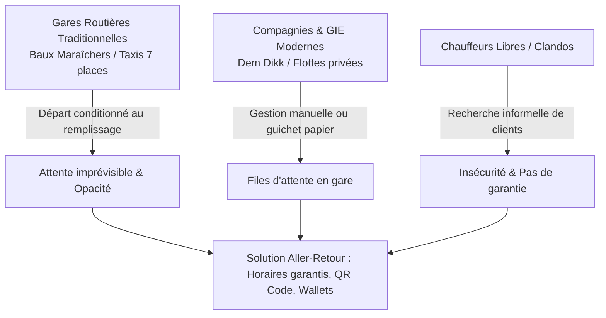
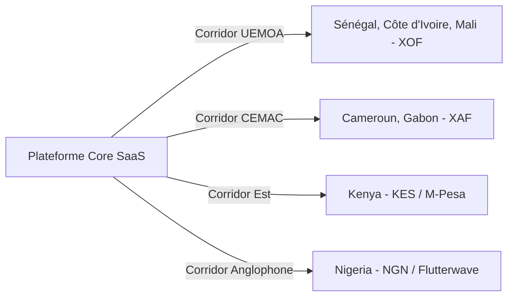
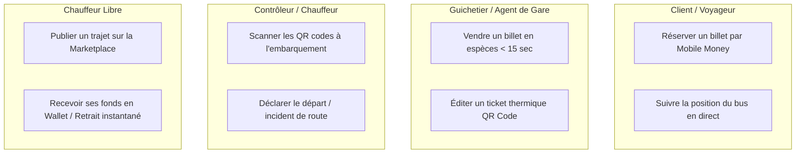
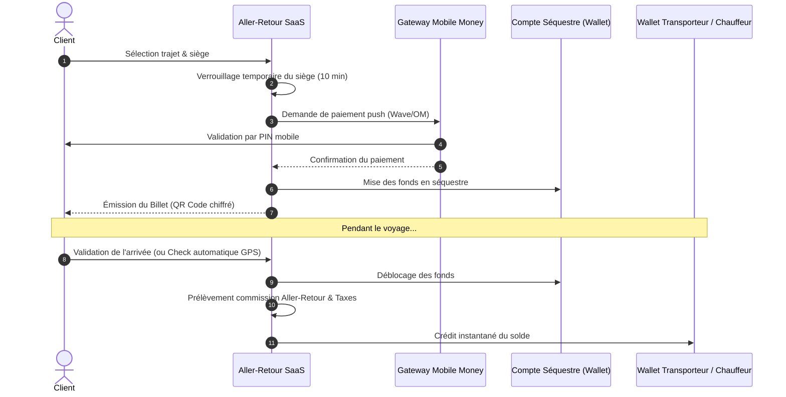
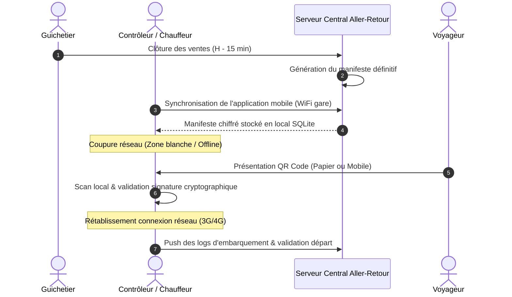

# ANALYSE TERRAIN, EXTENSION AFRIQUE & FLUX MÉTIER — ALLER-RETOUR
**Analyse Écosystémique & Spécifications des Flux Métier (SaaS Transport & Marketplace)**

---

## 1. ANALYSE DE LA RÉALITÉ TERRAIN : LE CAS DU SÉNÉGAL

Le marché sénégalais constitue un excellent laboratoire (Proof of Concept à grande échelle) avant toute expansion panafricaine. Il combine une forte densité de déplacements inter-urbains et une adoption massive des technologies financières mobiles.

### 1.1. Les Gares Routières Traditionnelles (Baux Maraîchers, gares régionales)
* **Fonctionnement actuel :** Modèle de départ "au remplissage complet" (turn-around). Les voyageurs se rendent en gare sans certitude sur l'heure de départ. Le système est rythmé par les "coxeurs" (rabatteurs) qui prélèvent des commissions informelles.
* **Le défi Aller-Retour :** Introduire la réservation garantie à l'avance sans perturber violemment l'écosystème local. Permettre aux gestionnaires de gares de digitaliser les feuilles de départ et de toucher leurs redevances de manière traçable.

### 1.2. Compagnies de Transport et GIE
* **Fonctionnement actuel :** Flottes structurées (bus climatisés de 50 places ou minibus VIP) mais dépendantes de guichets physiques surchargés. La comptabilité de fin de journée se fait en espèces avec des risques importants d'écarts de caisse et de fraude.
* **Le défi Aller-Retour :** Fournir un portail administrateur (SaaS Tenant) permettant de gérer les grilles horaires, de suivre la trésorerie en temps réel et de verrouiller le contrôle d'embarquement via des scanners de billets.

### 1.3. Les Chauffeurs Libres (Taxis 7 places, minibus indépendants)
* **Fonctionnement actuel :** Ils paient des frais journaliers en gare routière pour avoir le droit de charger. En dehors des gares, ils peinent à trouver des clients de confiance pour rentabiliser un aller-retour.
* **Le défi Aller-Retour :** Créer une Marketplace de confiance. Un chauffeur vérifié (KYC) peut publier son trajet, garantir son départ et recevoir les fonds sur son Wallet dès que les passagers ont validé leur arrivée.

### 1.4. Le Monopole du Mobile Money (Wave, Orange Money, Free Money)
* Au Sénégal, plus de 90% des transactions financières digitales transitent par Mobile Money, en particulier **Wave** (avec son modèle à frais réduits) et **Orange Money**.
* Le paiement par carte bancaire est anecdotique sur le marché inter-urbain de masse.
* Notre architecture doit intégrer des flux de paiement Mobile Money instantanés (via API directes ou via des agrégateurs comme PayDunya / Intouch / FedaPay).

### 1.5. La Réservation au Guichet (Hybridation Physique / Digital)
* Même avec une excellente application mobile, un pourcentage important d'usagers continuera d'acheter ses billets directement en gare ou auprès d'agents intermédiaires (kiosques multiservices).
* **Besoins terrain :** L'interface guichetier (Web / Tablette) doit permettre l'émission d'un billet en moins de 15 secondes (sélection de destination -> encaissement espèces ou push Mobile Money -> impression immédiate d'un ticket thermique avec QR code).

### 1.6. Faible Connectivité & Résilience
* Les grands axes routiers (Dakar-Tambacounda, Kaolack-Ziguinchor via la Gambie, Matam) traversent des zones à faible connectivité 2G/3G ou sujettes à des coupures réseau.
* **Stratégie Offline-First :** L'application de contrôle (téléphone du chauffeur ou contrôleur) doit télécharger la liste des passagers (manifeste) avant le départ. Le scan du QR code vérifie la signature cryptographique localement sans nécessiter d'appel serveur instantané.

---

## 2. PRÉPARATION À L'EXTENSION AFRIQUE (SCALABILITÉ PANAFRICAINE)

L'architecture logicielle doit être conçue dès le premier jour pour s'étendre à de nouveaux territoires sans refonte de la base de données ou de la logique centrale.

### 2.1. Multi-Pays & Multi-Devises
* **Séparation par Pays / Tenant :** La base de données gère les entités par pays (codes ISO 3166-1) et devises (ISO 4217).
* **Gestion des devises :** FCFA XOF (Afrique de l'Ouest), FCFA XAF (Afrique Centrale), GNF (Guinée), NGN (Nigeria), KES (Kenya), USD/EUR pour la diaspora.
* **Corridors frontaliers :** Prise en compte des trajets transfrontaliers (ex: Dakar-Bamako, Abidjan-Ouagadougou) nécessitant la gestion du change et des formalités douanières.

### 2.2. Moteur Fiscal et Taxes d'État
* Chaque pays applique une fiscalité différente : TVA (18% au Sénégal), taxes municipales de gare, redevances routières, ou retenues à la source pour le transport informel.
* Le système dispose d'un moteur de règles fiscales configurable par pays et par ville, calculant automatiquement les parts à reverser au Trésor Public ou aux municipalités.

### 2.3. Multilinguisme, Accessibilité et Inclusivité
* **Langues :** Français, Anglais, Wolof, Pulaar, Bambara, Swahili.
* **Accessibilité :** Pour pallier l'illettrisme ou les barrières linguistiques, l'interface voyageur s'appuie fortement sur des repères visuels (icônes de villes, couleurs de bus) et intègre des messages vocaux (ex: confirmation audio de réservation en Wolof).
* **Canaux alternatifs :** Interface USSD (`*123#`) et Bot WhatsApp automatisé pour les utilisateurs ne disposant pas de smartphone ou de données mobiles.

### 2.4. Intégration des Mobile Money Locaux
* Pour une expansion rapide, la plateforme s'interface avec des agrégateurs panafricains (Flutterwave, FedaPay, DPO Group, Hub2) pour couvrir instantanément MTN MoMo (Côte d'Ivoire/Cameroun/Benin), Moov Money, Airtel Money, M-Pesa (Kenya), et les cartes bancaires internationales (Visa/Mastercard pour les touristes et la diaspora).

---

## 3. CAS UTILISATEURS (USE CASES)

### UC1 : Voyageur - Réservation et Paiement Mobile
1. Le client ouvre l'application web/mobile (ou WhatsApp).
2. Il choisit Dakar -> Thiès pour le lendemain 08h00 sur la compagnie "Sénégal TransExpress".
3. Il choisit son siège (ex: Siège #12, côté fenêtre).
4. Il valide et entre son numéro Wave.
5. Une notification push apparaît sur son téléphone ; il met son code PIN Wave pour payer.
6. Il reçoit son billet numérique avec un QR code sécurisé.

### UC2 : Guichetier - Vente Rapide en Gare
1. Un voyageur sans téléphone se présente au guichet physique de la gare de Touba à 07h50.
2. Le guichetier sélectionne le prochain départ pour Dakar sur son terminal POS Android.
3. Il encaisse 4 000 FCFA en espèces.
4. L'imprimante thermique intégrée au POS sort instantanément le ticket papier avec le QR Code d'embarquement.
5. Le siège #34 est verrouillé dans le système central en temps réel.

### UC3 : Contrôleur / Chauffeur - Embarquement Offline
1. À 08h00, devant la porte du bus, le contrôleur utilise son smartphone.
2. Il n'a plus de forfait internet, mais l'application a mis en cache le manifeste des 50 passagers à 07h45.
3. Il scanne le QR code (papier ou écran) de chaque voyageur. Le téléphone émet un bip vert (Validé) ou rouge (Déjà scanné / Invalide).
4. À la fin de l'embarquement, l'application génère un rapport complet qui se synchronisera dès le premier signal réseau disponible sur la route.

### UC4 : Chauffeur Libre - Trajet Marketplace et Gain en Wallet
1. Modou, chauffeur indépendant avec un Peugeot 5008 de 7 places, prévoit d'aller de Dakar à Saint-Louis vendredi soir.
2. Il publie son trajet sur la Marketplace Aller-Retour à 7 000 FCFA la place.
3. 6 voyageurs réservent et paient par Orange Money. Les fonds (42 000 FCFA) sont placés en compte séquestre (Escrow) sur la plateforme.
4. À l'arrivée à Saint-Louis, Modou valide la fin du trajet. Les passagers confirment ou le GPS certifie l'arrivée.
5. 42 000 FCFA moins 8% de commission plateforme (38 640 FCFA) sont versés instantanément sur le Wallet Aller-Retour de Modou. Il effectue un retrait immédiat vers son compte Wave.

---

## 4. FLUX MÉTIER MAJEURS (WORKFLOWS)

### 4.1. Flux de Réservation & Séquestre Financier (Escrow)

### 4.2. Flux du Manifeste de Départ et Contrôle en Gare

---

## 5. BESOINS MATÉRIELS ET TERRAIN (POUR LES GARES ROUTIÈRES)
Pour garantir l'adoption de la plateforme sur le terrain, l'infrastructure logicielle doit s'accompagner de préconisations matérielles robustes :
1. **Terminaux POS Android Tout-en-Un :** Appareils portables équipés d'un écran tactile, d'une caméra de scan rapide, d'une puce 4G multi-opérateurs et d'une imprimante thermique intégrée (ex: Sunmi V2 Pro).
2. **Autonomie Énergétique :** Batteries de secours (Powerbanks) solaires ou renforcées pour les kiosques en gare routière soumis à des délestages électriques.
3. **Imprimantes Thermiques de Guichet :** Imprimantes fixes connectées en USB/Bluetooth pour une vitesse d'impression industrielle dans les grandes gares (Dakar Baux Maraîchers).
