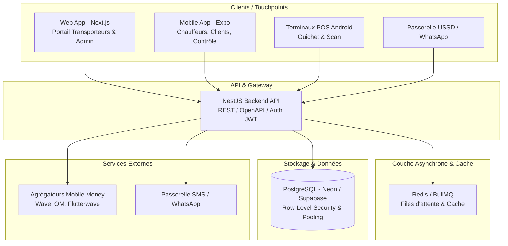
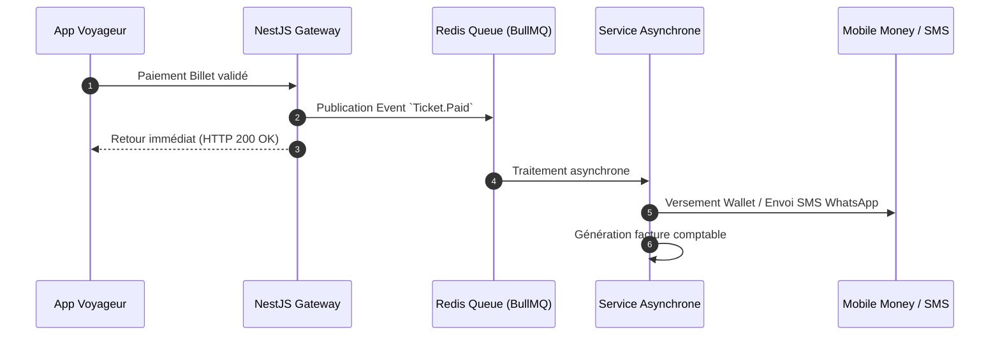

# ARCHITECTURE TECHNIQUE & MULTI-TENANCY — ALLER-RETOUR
**Spécifications Architecturales, Comparatifs et Choix Technologiques (SaaS & Marketplace)**

---

## 1. ARCHITECTURE GLOBALE DU SYSTÈME

Le système Aller-Retour repose sur une architecture modulaire en couche, conçue pour séparer le portail Web (SaaS / Admin), l'application Mobile (Chauffeurs / Clients) et le moteur API Backend centralisé.



---

## 2. ARCHITECTURE MULTI-TENANT (STOCKAGE DES DONNÉES)

La gestion du multi-tenant (hébergement de plusieurs compagnies de transport sur la même infrastructure) est la décision la plus critique pour la sécurité et la rentabilité financière.

### 2.1. Comparatif des approches Multi-Tenant

| Approche / Critère | 1. Database per Tenant (1 BDD par Transporteur) | 2. Schema per Tenant (1 Schéma par Transporteur) | 3. Single DB + Discriminator Column (`tenantId`) + RLS |
| :--- | :--- | :--- | :--- |
| **Sécurité & Isolation** | Maximale (physiquement séparé) | Élevée (schémas distincts dans la BDD) | Très Élevée (via PostgreSQL Row-Level Security) |
| **Coût d'Infrastructure** | Très élevé (des centaines d'instances BDD) | Moyen (consommation mémoire croissante) | Très Faible (optimisation des ressources sur 1 cluster) |
| **Complexité des Migrations** | Cauchemardesque (boucle sur 500+ BDDs) | Difficile (boucle sur 500+ schémas) | Simple (1 seule migration Prisma unifiée) |
| **Requêtes Marketplace (Cross-Tenant)** | Quasiment impossible sans ETL lourd | Complexe (jointures inter-schémas) | Native et instantanée (filtre WHERE ou vue globale) |
| **Scalabilité Panafricaine** | Faible (limite de serveurs) | Moyenne (limite de connexions/schémas) | Excellente |

### 2.2. Choix Technique Justifié
**Décision : Base de données unique (Single DB) avec colonne discriminante `tenantId` et isolation par PostgreSQL Row-Level Security (RLS).**

**Justification :** 
1. **Économie d'échelle :** Permet d'onboarder des milliers de GIE, petites flottes et chauffeurs libres sans aucun coût fixe additionnel par transporteur.
2. **Cohabitation SaaS B2B et Marketplace B2C :** Pour permettre à un voyageur de rechercher un billet sur toutes les compagnies en même temps (Marketplace), toutes les lignes doivent résider dans la même base de données.
3. **Sécurité garantie :** L'utilisation de RLS (Row-Level Security) au niveau de PostgreSQL et de Guards d'isolation au niveau de NestJS garantit qu'un guichetier de la compagnie A ne pourra jamais voir ou altérer les billets de la compagnie B.

---

## 3. FLUX API (COMMUNICATION CLIENTS → SERVEUR)

### 3.1. Comparatif des protocoles API

| Protocole | Avantages | Inconvénients | Pertinence Aller-Retour |
| :--- | :--- | :--- | :--- |
| **GraphQL** | Flexibilité des requêtes, sur-mesure par écran. | Mise en cache HTTP difficile, risque de requêtes lourdes (N+1), overhead CPU. | Faible (inadapté aux terminaux POS à faible CPU). |
| **tRPC** | Type-safety absolu TypeScript bout-en-bout. | Couplage total front/back, inadapté aux intégrations externes ou aux webhooks. | Moyenne. |
| **REST (OpenAPI/Swagger)** | Standard universel, excellente mise en cache HTTP, intégration facile avec POS / USSD / Mobile Money. | Multiplicité des endpoints si mal architecturé. | **Maximale (Choix retenu).** |

### 3.2. Choix Technique Justifié
**Décision : API REST modulaire documentée avec OpenAPI 3.0 (Swagger) sur NestJS.**
* Une API REST claire permet d'interfacer facilement des partenaires externes (agences de voyage, terminaux de paiement de gares routières, agrégateurs Mobile Money, opérateurs USSD).
* Nous générerons automatiquement le SDK client TypeScript via Swagger/OpenAPI pour maintenir le type-safety strict avec notre frontend Next.js et notre app mobile Expo.

---

## 4. COMMUNICATION INTER-SERVICES & ASYNCHRONISME

Pour éviter les pannes en cascade lors des pics de fréquentation (Magal, Gamou, Tabaski), l'API ne doit pas effectuer d'opérations lourdes de manière synchrone.



### 4.1. Approche : Event-Driven Architecture (EDA) via Redis / BullMQ
Dès qu'un événement critique survient (ex: validation de paiement, départ de bus), l'API REST publie un événement dans une file d'attente en mémoire (Redis) et répond instantanément à l'utilisateur.
Des *Workers* asynchrones consomment ces événements en arrière-plan pour :
* Générer les PDF de factures et billetterie.
* Envoyer les notifications SMS et WhatsApp.
* Distribuer les commissions dans les Wallets (Escrow vers Chauffeur/Transporteur/Plateforme).
* Envoyer les rapports fiscaux aux serveurs de l'État.

---

## 5. MODULES DU BACKEND (NESTJS)

L'architecture du backend NestJS sera structurée en modules hautement cohésifs et faiblement couplés :

```text
apps/api/src/
├── core/
│   ├── auth/            # Authentification (JWT, Refresh Token, MFA)
│   ├── rbac/            # Rôles et Permissions (SuperAdmin, TenantAdmin, Guichetier, etc.)
│   ├── tenant/          # Isolation multi-tenant (Intercepteur et Guards de contexte)
│   └── prisma/          # Connecteur et client BDD partagé
├── modules/
│   ├── companies/       # Gestion des transporteurs et GIE (Tenants)
│   ├── fleet/           # Gestion des véhicules (Assurance, capacité, statut)
│   ├── drivers/         # Gestion des chauffeurs affiliés et libres (KYC, notation)
│   ├── routes/          # Gestion des lignes de transport, arrêts et grilles horaires
│   ├── bookings/        # Moteur de réservation, allocation de sièges et QR Codes
│   ├── wallets/         # Moteur financier (Comptes, dépôts, retraits, Escrow)
│   ├── parcels/         # Gestion des colis et excédents de bagages
│   └── analytics/       # Moteur de statistiques, taux de remplissage et fiscalité
└── app.module.ts        # Module racine de l'application
```
