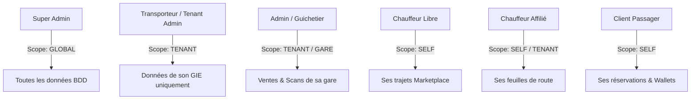

# MATRICE DES RÔLES & PERMISSIONS (RBAC) — ALLER-RETOUR
**Modèle de Contrôle d'Accès Granulaire et Scopes de Sécurité Multi-Tenant**

---

## 1. PHILOSOPHIE DE SÉCURITÉ & SCOPES

Le système de contrôle d'accès de la plateforme Aller-Retour combine le **RBAC (Role-Based Access Control)** et l'**ABAC (Attribute-Based Access Control)**.

Chaque permission est évaluée dans un *Scope* (Périmètre) spécifique :
1. **Scope `GLOBAL`** : Accès inconditionnel à toutes les entités du système (réservé aux Super Administrateurs).
2. **Scope `TENANT`** : Accès limité aux ressources appartenant à la compagnie (`companyId` de l'utilisateur == `companyId` de la ressource).
3. **Scope `SELF`** : Accès strictement restreint aux ressources de l'utilisateur (ses propres billets, son propre véhicule, son propre Wallet).

---

## 2. NOMENCLATURE DES PERMISSIONS UNITAIRES

Les permissions suivent une convention stricte : `ressource:action`.

### 2.1. Gestion des Tenants & Entreprises (`companies`)
* `companies:create` : Créer un nouveau GIE / Transporteur.
* `companies:read` : Voir le profil d'un transporteur.
* `companies:update` : Modifier les informations (NINEA, adresse, logo).
* `companies:delete` : Désactiver ou supprimer un transporteur.
* `companies:billing` : Gérer l'abonnement SaaS (Standard, Premium).

### 2.2. Gestion des Flottes & Véhicules (`vehicles`)
* `vehicles:create` : Enregistrer un nouveau bus ou taxi.
* `vehicles:read` : Consulter la liste des véhicules.
* `vehicles:update` : Mettre à jour l'assurance ou la visite technique.
* `vehicles:inspect` : Marquer un véhicule comme apte ou en maintenance.

### 2.3. Gestion des Chauffeurs & KYC (`drivers`)
* `drivers:read` : Voir le profil et l'historique d'un chauffeur.
* `drivers:kyc_verify` : Valider ou rejeter un permis biométrique.
* `drivers:assign` : Affecter un chauffeur à un véhicule et à une ligne.

### 2.4. Gestion des Lignes & Horaires (`routes` & `trips`)
* `routes:manage` : Créer ou modifier une ligne entre deux gares routières.
* `trips:schedule` : Programmer un départ horaire.
* `trips:marketplace_publish` : Publier un trajet indépendant (Chauffeur libre).
* `trips:dispatch` : Déclencher l'autorisation de départ en gare.
* `trips:manifest_download` : Télécharger le manifeste des passagers en cache local.

### 2.5. Réservation, Billetterie & Scan (`bookings`)
* `bookings:create` : Émettre un nouveau billet.
* `bookings:read_self` : Consulter son propre historique de voyages.
* `bookings:cancel` : Annuler un billet et demander le remboursement.
* `bookings:scan` : Contrôler et valider un QR Code à l'embarquement.

### 2.6. Moteur Financier, Wallets & Escrow (`wallets` & `finance`)
* `wallets:read` : Voir le solde d'un Wallet.
* `wallets:deposit` : Dépôt par Wave / Orange Money.
* `wallets:withdraw` : Déclencher un virement sortant instantané.
* `finance:escrow_hold` : Mettre des fonds en compte séquestre.
* `finance:escrow_release` : Libérer les fonds après validation d'arrivée.
* `finance:commission_audit` : Configurer et auditer les taux de commission.
* `finance:tax_report` : Exporter les déclarations fiscales de redevances d'État.

---

## 3. MATRICE DÉTAILLÉE DES RÔLES

| Permission / Rôle | Client | Chauffeur Affilié | Chauffeur Libre | Admin (Guichetier) | Transporteur (Tenant) | Super Admin |
| :--- | :---: | :---: | :---: | :---: | :---: | :---: |
| **`companies:create/delete`** | ❌ | ❌ | ❌ | ❌ | ❌ | ✅ |
| **`companies:update`** | ❌ | ❌ | ❌ | ❌ | ✅ (Son GIE) | ✅ |
| **`vehicles:create/update`** | ❌ | ❌ | ✅ (Son véhicule) | ❌ | ✅ (Sa flotte) | ✅ |
| **`drivers:kyc_verify`** | ❌ | ❌ | ❌ | ❌ | ❌ | ✅ |
| **`trips:schedule`** | ❌ | ❌ | ❌ | ✅ (Sa gare) | ✅ (Ses lignes) | ✅ |
| **`trips:marketplace_publish`** | ❌ | ❌ | ✅ | ❌ | ❌ | ✅ |
| **`trips:manifest_download`** | ❌ | ✅ (Son bus) | ✅ (Son bus) | ✅ (Sa gare) | ✅ (Son GIE) | ✅ |
| **`bookings:create`** | ✅ (Self) | ❌ | ❌ | ✅ (Guichet) | ✅ | ✅ |
| **`bookings:scan`** | ❌ | ✅ (Son bus) | ✅ (Son bus) | ✅ (Sa gare) | ✅ | ✅ |
| **`wallets:withdraw`** | ✅ (Self) | ✅ (Self) | ✅ (Self) | ❌ | ✅ (Compagnie) | ✅ |
| **`finance:escrow_release`** | ✅ (Client OK) | ❌ | ✅ (Arrivée OK) | ❌ | ❌ | ✅ (Automatique) |
| **`finance:commission_audit`** | ❌ | ❌ | ❌ | ❌ | ❌ | ✅ |

---

## 4. DÉFINITION APPROFONDIE DES RÔLES (FRONTIÈRES MÉTIER)

### 4.1. Client / Passager
* **Périmètre d'action :** Uniquement ses propres réservations, ses colis expédiés et son propre Wallet personnel.
* **Limites :** Ne peut voir aucun passager d'un bus (anonymat garanti), ne peut agir sur le statut d'un véhicule.

### 4.2. Chauffeur Affilié
* **Périmètre d'action :** Employé par un GIE. Il n'a accès qu'aux trajets qui lui sont expressément assignés.
* **Pouvoirs :** Peut télécharger le manifeste passagers de sa tournée, scanner les QR Codes à l'embarquement, et déclarer un retard ou un incident mécanique en direct sur l'application mobile.

### 4.3. Chauffeur Libre (Indépendant sur Marketplace)
* **Périmètre d'action :** Entrepreneur indépendant.
* **Pouvoirs :** Une fois son KYC validé (Permis biométrique + photo véhicule validés par le Super Admin), il peut créer ses propres lignes temporaires, fixer son tarif (dans les limites des grilles de l'État), et recevoir ses fonds en Wallet avec retrait Wave instantané dès la validation d'arrivée.

### 4.4. Admin / Guichetier (Dispatcher de Gare)
* **Périmètre d'action :** Agent physique opérant en gare routière sur terminal POS Android.
* **Pouvoirs :** Vente ultra-rapide de billets en espèces, impression de QR Codes thermiques, réaffectation de passagers en cas de panne de bus, et clôture de la caisse de fin de journée pour versement sur le compte du transporteur.

### 4.5. Transporteur (Gestionnaire de GIE / Tenant Admin)
* **Périmètre d'action :** Le patron ou responsable d'exploitation de la compagnie de transport.
* **Pouvoirs :** Contrôle total de son GIE dans un silo isolé (Tenant). Ajoute/supprime ses chauffeurs et guichetiers, définit les horaires de ses bus, suit le chiffre d'affaires et la trésorerie en temps réel.

### 4.6. Super Admin (Équipe Aller-Retour)
* **Périmètre d'action :** L'opérateur souverain de la plateforme.
* **Pouvoirs :** Onboarde les transporteurs B2B, valide les chauffeurs libres de la marketplace, gère les grilles de commissions, supervise la santé des serveurs et audite les reversements fiscaux de l'État.
