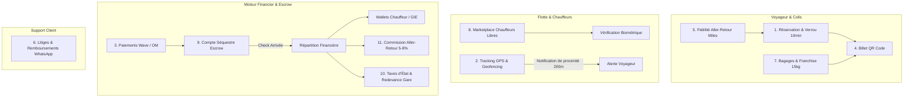
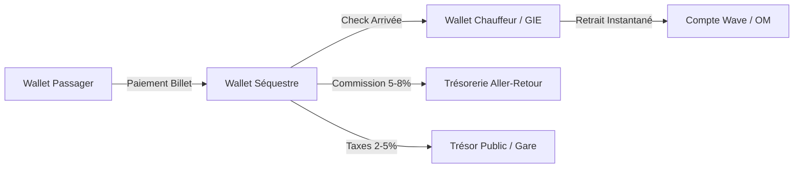

# SPÉCIFICATIONS FONCTIONNELLES & RÈGLES MÉTIER — ALLER-RETOUR
**Dictionnaire des Règles Métier et Spécifications Opérationnelles Panafricaines**

---

---

## 1. RÈGLES DE RÉSERVATION & ALLOCATION DE SIÈGES

### 1.1. Le Verrou Atomique Concurrent (Seat Lock)
* **Règle :** Lorsqu'un passager sélectionne un siège (ex: Siège #12 sur le départ Dakar-Touba de 08h00), le serveur place un verrou atomique dans Redis pour une durée exacte de **10 minutes** (`TTL = 600s`).
* **Effet :** Pendant ces 10 minutes, ce siège apparaît grisé (En cours de réservation) pour tous les autres utilisateurs et guichetiers. Si le paiement Wave/OM n'est pas confirmé avant la fin du chronomètre, le verrou saute et le siège redevient libre.

### 1.2. Grille d'Annulation et Remboursement
* **Annulation > 24h avant le départ :** Remboursement à **100%** sur le Wallet du client (sans frais).
* **Annulation entre 24h et 6h avant le départ :** Remboursement à **50%** (50% conservés pour le transporteur en dédommagement).
* **Annulation < 6h avant le départ ou Non-présentation en gare :** **0%** de remboursement.

---

## 2. RÈGLES DU TRACKING GPS & GEOFENCING

### 2.1. Fréquence de Transmission
* En mouvement, l'application mobile du chauffeur (ou boîtier GPS embarqué) pousse ses coordonnées `(lat, lng, vitesse)` au serveur via Socket.io toutes les **15 secondes** en zone couverte par la 3G/4G. En zone blanche, les points GPS sont stockés dans un buffer local SQLite et poussés en un seul lot au retour du réseau.

### 2.2. Geofencing de Gare Routière
* Chaque gare (Baux Maraîchers, Gare de Touba, etc.) est délimitée en base de données par un cercle de **200 mètres de rayon** (Geofence PostGIS).
* **Déclenchement automatique :** Lorsque les coordonnées GPS du bus entrent dans ce rayon, le système notifie automatiquement les proches des voyageurs : *"Le bus Sénégal Express 402 approche de la gare de Touba. Arrivée estimée dans 3 minutes."*

---

## 3. RÈGLES DE PAIEMENT & SÉQUESTRE (ESCROW)

### 3.1. Mécanisme du Compte Séquestre
* Pour lutter contre la fraude et garantir l'exécution du trajet, **100% des fonds** versés par les clients via Wave ou Orange Money sont placés sur un compte séquestre virtuel (`ESCROW_WALLET`) de la plateforme. Le transporteur ou chauffeur libre ne touche rien au moment de la réservation.

### 3.2. Règle de Libération des Fonds (Release)
* Les fonds sont libérés et transférés vers le Wallet du transporteur à la survenue du premier de ces deux événements :
  1. Le chauffeur et 50% des passagers valident l'arrivée dans l'application.
  2. Le serveur central détecte par GPS que le bus est resté plus de 10 minutes dans la zone de Geofence de la gare d'arrivée.

---

## 4. BILLETTERIE QR & VALIDATION OFFLINE

### 4.1. Chiffrement du Token
* Le QR Code affiché sur l'application ou imprimé sur ticket papier n'est pas une simple chaîne de texte. C'est un jeton chiffré contenant le `tripId`, le `seatNumber`, le `passengerPhone` et une signature HMAC-SHA256 générée avec une clé privée propre à chaque GIE.
* **Résilience Offline :** Au moment du scan à la porte du bus, le téléphone du contrôleur (qui a mis le manifeste en cache) valide mathématiquement la signature HMAC sans avoir besoin d'interroger le serveur en ligne.

---

## 5. PROGRAMME DE FIDÉLITÉ "ALLER-RETOUR MILES"

### 5.1. Acquisition des Points
* **Barème standard :** Chaque tranche de **10 FCFA dépensée** sur la plateforme (billets ou colis) génère **1 Mile Aller-Retour**.
* **Bonus Écologique :** Privilégier les grands bus climatisés (50 places) au lieu des taxis 7 places génère un multiplicateur de **x1.5 Miles**.

### 5.2. Utilisation & Récompenses
* **1 000 Miles :** Bon de réduction de 1 000 FCFA valable sur tout trajet.
* **10 000 Miles :** Billet aller-retour VIP gratuit sur les corridors ouest-africains (Dakar-Bamako ou Dakar-Abidjan).

---

## 6. SUPPORT CLIENT & GESTION DES LITIGES

### 6.1. Canaux d'Assistance
* **Bot WhatsApp 24/7 :** Permet à un voyageur de déclarer la perte d'un bagage ou un retard de bus en envoyant simplement le numéro de son billet ou son QR Code.
* **Hotline Téléphonique :** Intégrée pour les guichetiers et transporteurs en cas d'urgence sur les routes.

### 6.2. Règle de Panne de Véhicule
* Si un bus tombe en panne en cours de route, le `DISPATCHER` de la compagnie doit déclencher l'action `Trip.Transfer`. La plateforme transfère automatiquement les passagers sur le prochain bus disponible de la même compagnie et leur octroie **500 Miles de dédommagement**.

---

## 7. GESTION DES BAGAGES & COLIS (FRET LÉGER)

### 7.1. Franchise Voyageur
* Chaque passager muni d'un billet a droit à une franchise gratuite de **15 kg** de bagages en soute.
* **Excédent :** Tout excédent est facturé à **100 FCFA / kg** au guichet d'enregistrement, générant une étiquette code-barres collée sur le bagage.

### 7.2. Fret Colis Indépendant
* Un usager peut envoyer un colis (ex: un sac de poissons séchés de Mbour à Tambacounda) sans voyager lui-même.
* Le système génère un QR de suivi (`trackingCode`). Le destinataire reçoit un SMS avec un code secret à 4 chiffres (PIN de retrait) qu'il devra fournir au chauffeur à l'arrivée pour récupérer son colis.

---

## 8. MARKETPLACE CHAUFFEURS LIBRES (RÈGLES STRICTES)

### 8.1. Le Filtre KYC (Know Your Customer)
* Aucun chauffeur libre ne peut publier un trajet sans avoir soumis :
  1. La photo recto/verso de son permis de conduire biométrique CEDEAO.
  2. La carte grise du véhicule.
  3. L'attestation d'assurance en cours de validité.
* La vérification est effectuée en moins de 48h par l'équipe Super Admin.

### 8.2. Règle de Réputation (Note Éliminatoire)
* À la fin de chaque trajet, les passagers notent le chauffeur de 1 à 5 étoiles sur 3 critères : *Sécurité de la conduite*, *Propreté du véhicule* et *Ponctualité*.
* **Sanction :** Si la note moyenne d'un chauffeur libre tombe en dessous de **4.2/5.0** sur ses 10 derniers trajets, son compte est automatiquement suspendu de la Marketplace pour 30 jours, avec obligation de repasser une inspection en gare.

---

## 9. WALLETS VIRTUELS & FLUX DE TRÉSORERIE

### 9.1. Typologie des Wallets
1. `PASSENGER_WALLET` : Portefeuille de recharge du voyageur pour ses achats express et remboursements.
2. `DRIVER_WALLET` : Portefeuille de gains du chauffeur libre.
3. `COMPANY_WALLET` : Trésorerie centralisée du GIE ou de la compagnie de transport.
4. `ESCROW_WALLET` : Compte d'attente (Séquestre) garantissant les trajets en cours.
5. `PLATFORM_TREASURY` : Compte encaissant les commissions Aller-Retour.

### 9.2. Retrait Instantané (Cash-out)
* Un chauffeur ou transporteur peut cliquer sur *Retrait* à tout moment. Via l'API de paiement intégrée, l'argent est viré en moins de **3 secondes** sur son compte Mobile Money (Wave ou Orange Money) sans plafond minimum.

---

## 10. RÈGLES FISCALES & TAXES D'ÉTAT

### 10.1. Retenue à la Source & Redevances de Gare
* Le secteur du transport inter-urbain est assujetti à des redevances de gares (ex: taxe municipale de départ à Baux Maraîchers).
* Notre moteur fiscal prélève automatiquement **2% à 5%** sur le prix du billet brut et reverse cette somme mensuellement sur le compte bancaire du Trésor Public ou du gestionnaire de la gare routière, offrant une transparence totale à l'État.

---

## 11. COMMISSIONS PLATEFORME (MODÈLE ÉCONOMIQUE)

### 11.1. Grille de Commissions
* **Pour les Transporteurs / GIE abonnés (SaaS B2B) :** Commission réduite de **5%** par billet vendu sur la plateforme en ligne.
* **Pour les Chauffeurs Libres (Marketplace B2C) :** Commission de **8%** sur le montant global du trajet.
* **Frais de Service (Passager) :** Ajout de **100 FCFA fixes** par transaction pour couvrir les frais de passerelle Mobile Money.
