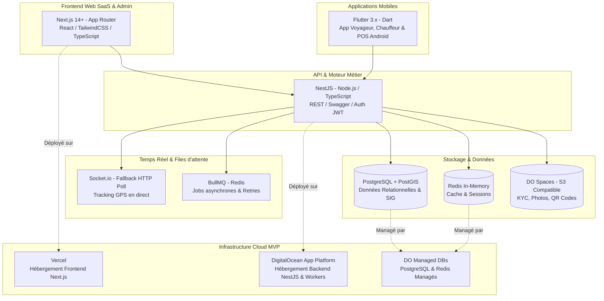
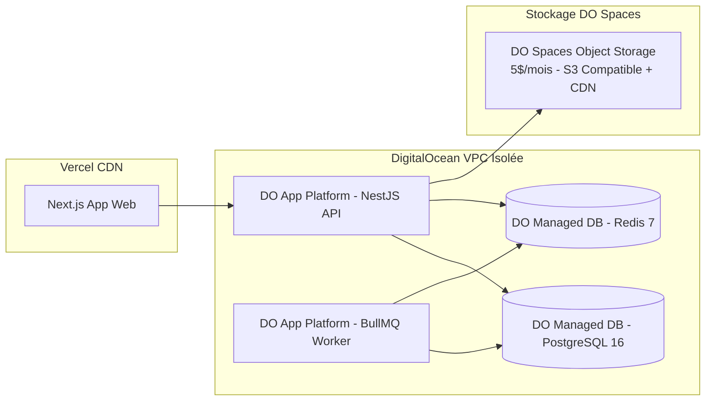

# STACK TECHNIQUE & INFRASTRUCTURE MVP — ALLER-RETOUR
**Comparatifs, Arbitrages et Justifications de la Stack Technologique Panafricaine**

---

## 1. VUE D'ENSEMBLE DE LA STACK VALIDÉE

---

## 2. COMPARATIFS ET JUSTIFICATIONS PAR COUCHE

### 2.1. Frontend Web : Next.js (App Router & React Server Components)
* **Comparaison :** *Next.js* vs *React SPA classique (Vite)* vs *Vue.js / Nuxt*.
* **Justification du choix :** 
  1. **SEO & Vitesse de chargement :** Pour le portail public de recherche de trajets inter-urbains, le Server-Side Rendering (SSR) et l'Incremental Static Regeneration (ISR) garantissent un référencement optimal sur Google et des temps de chargement instantanés, même sur des connexions lentes.
  2. **Productivité SaaS B2B :** L'écosystème React couplé à TailwindCSS et des bibliothèques de composants robustes (shadcn/ui) permet de construire les tableaux de bord transporteurs et l'interface guichetier très rapidement.
  3. **Synergie Vercel :** Déploiement natif et immédiat avec zero-config sur l'infrastructure Vercel.

### 2.2. Application Mobile : Flutter (Dart)
* **Comparaison :** *Flutter* vs *React Native / Expo* vs *Développement Natif (Kotlin Android / Swift iOS)*.
* **Justification du choix :**
  1. **Performance sur Android bas de gamme :** En Afrique, le parc mobile est dominé à plus de 85% par des terminaux Android (Samsung, Tecno, Infinix, Itel). Le moteur de rendu Skia/Impeller de Flutter compile en code machine ARM natif, assurant un affichage fluide à 60fps sans le goulot d'étranglement du pont JavaScript (JS Bridge) de React Native.
  2. **Compatibilité Terminaux POS (Sunmi, Pax) :** Les gares routières utiliseront des terminaux POS Android avec imprimante thermique intégrée. Flutter dispose d'excellents packages natifs (ex: `sunmi_printer_plus`, `esc_pos_printer`) pour piloter ces périphériques en Bluetooth/USB en quelques millisecondes.
  3. **Robustesse Offline :** Couplé avec des bases de données embarquées ultra-rapides comme *Isar* ou *SQLite*, Flutter gère parfaitement le stockage local des billets et des manifestes passagers pour les zones blanches.

### 2.3. Backend API : NestJS (TypeScript)
* **Comparaison :** *NestJS (Node.js)* vs *Spring Boot (Java)* vs *Django (Python)* vs *Go / Gin*.
* **Justification du choix :**
  1. **Partage de code (Monorepo TypeScript) :** Permet de partager les types (DTOs, contrats d'API, validateurs) entre le backend NestJS et le frontend Next.js.
  2. **Architecture Entreprise :** Son système d'injection de dépendances et de modularité garantit un code propre, structuré et maintenable en équipe à mesure que le projet grandit.
  3. **Écosystème riche :** Support natif de Swagger/OpenAPI, intégration parfaite avec BullMQ, Socket.io, Prisma et Redis.

### 2.4. Base de Données & Géospatial : PostgreSQL + PostGIS
* **Comparaison :** *PostgreSQL + PostGIS* vs *MongoDB* vs *MySQL*.
* **Justification du choix :**
  1. **Intégrité Transactionnelle (ACID) :** Indispensable pour la gestion financière des Wallets, des comptes séquestres (Escrow) et des prélèvements de taxes.
  2. **Puissance Géospatiale (PostGIS) :** Indispensable pour la mobilité. PostGIS permet de créer des géofences (zones géographiques délimitant les gares routières de Touba, Dakar Baux Maraîchers, etc.), de calculer des distances exactes, d'indexer la position GPS des bus en transit et de détecter automatiquement l'entrée ou la sortie de gare.

### 2.5. Cache & Verrous Distribués : Redis
* **Justification du choix :**
  1. **Verrouillage de sièges concurrents :** Lorsqu'un client sélectionne le siège #12 sur l'application, Redis pose un verrou atomique (TTL de 10 minutes) pour empêcher qu'un guichetier ou un autre utilisateur ne réserve le même siège simultanément.
  2. **Rate Limiting & Sécurité :** Protection contre les attaques DDoS et la fraude sur les requêtes de paiement Mobile Money.

### 2.6. Temps Réel : Socket.io vs WebSocket Brut
* **Comparaison :** *Socket.io* vs *WebSocket standard* vs *Server-Sent Events (SSE)*.
* **Justification du choix :**
  1. **Résilience en connectivité instable (Afrique) :** C'est l'argument décisif. Les WebSockets standards se déconnectent fréquemment sur les réseaux mobiles 3G/4G en mouvement. Socket.io intègre un mécanisme de **fallback automatique vers HTTP Long-Polling** si le WebSocket échoue, ainsi qu'une reconnexion automatique avec mise en mémoire tampon (buffering) des paquets perdus.
  2. **Rooms / Salons de diffusion :** Permet de créer un salon par trajet (ex: `trip_Dakar_Thies_984`). Seuls les voyageurs de ce bus reçoivent les coordonnées GPS exactes en direct.

### 2.7. Files d'Attente Asynchrones : BullMQ (Redis)
* **Comparaison :** *BullMQ (Redis)* vs *RabbitMQ* vs *Kafka*.
* **Justification du choix :**
  1. **Simplicité et Performance :** Exploite notre instance Redis existante sans nécessiter l'installation et la maintenance d'un cluster lourd comme Kafka.
  2. **Fonctionnalités Avancées :** Gestion native des retries exponentiels (crucial si l'API de Wave ou Orange Money subit un ralentissement temporaire), planification de tâches (ex: clôturer automatiquement les ventes 15 minutes avant le départ) et gestion de la concurrence.

---

## 3. INFRASTRUCTURE MVP PRODUCTION-READY (VERCEL + DIGITALOCEAN)

Pour l'étape MVP, l'objectif est d'avoir une infrastructure robuste, sécurisée et hautement disponible, tout en évitant les factures imprévisibles et la complexité opérationnelle d'AWS ou GCP.

### 3.1. Frontend : Vercel
* Hébergement gratuit ou très faible coût pour le frontend Next.js.
* Déploiement automatisé à chaque `git push`, Edge CDN mondial garantissant une latence minimale.

### 3.2. Backend & Workers : DigitalOcean App Platform (PaaS)
* **Pourquoi ?** C'est une solution Platform-as-a-Service (PaaS) similaire à Heroku mais beaucoup plus économique et performante.
* **Avantage de facturation :** Coûts fixes et prédictibles. Aucun risque d'explosion de facture en cas d'attaque ou de pic inattendu.
* **Sécurité :** L'API NestJS et le Worker BullMQ s'exécutent dans un réseau privé virtuel (VPC) isolé.

### 3.3. Bases de Données : DigitalOcean Managed PostgreSQL & Redis
* **Sérénité opérationnelle (Zero DevOps) :** Les bases de données managées incluent les sauvegardes quotidiennes automatisées (Point-in-time recovery), le chiffrement des données au repos et en transit (TLS/SSL) et le monitoring en temps réel.
* La base de données n'est accessible que depuis le réseau VPC de la DigitalOcean App Platform (fermeture totale au réseau internet public).

### 3.4. Stockage Fichiers : DigitalOcean Spaces (Compatible S3)
* **Tarif imbattable :** 5$/mois pour 250 Go de stockage et 1 To de bande passante sortante.
* **Cas d'usage :** Hébergement des pièces d'identité et permis de conduire biométriques (KYC chauffeurs libres), photos d'inspection des véhicules, génération d'étiquettes de bagages et QR codes d'embarquement.
* CDN mondial intégré (Cloudflare) pour un chargement instantané des images sur l'application mobile Flutter.
