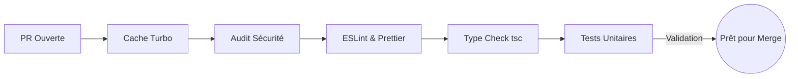

# STRATÉGIE DE DÉPLOIEMENT CI/CD & GITOPS — ALLER-RETOUR
**Orchestration Panafricaine : GitHub Actions, Vercel (Frontend Web) et DigitalOcean (Backend API)**

---

```mermaid
graph TD
    subgraph 1. Écosystème Développeur
        DEV[Développeur Local] -->|git push| PR[Pull Request sur GitHub]
    end

    subgraph 2. GitHub Actions CI/CD
        PR --> CI[GitHub Actions: Lint, TypeCheck & Tests]
        CI -->|Succès| MERGE[Merge vers branche main / staging]
    end

    subgraph 3. Déploiement Staging (Préproduction)
        MERGE -->|Branche: staging| STG_WEB[Vercel Preview Deployment]
        MERGE -->|Branche: staging| STG_API[DigitalOcean App: API Staging]
    end

    subgraph 4. Déploiement Production (Sénégal & Afrique)
        MERGE -->|Branche: main| PROD_WEB[Vercel Production Edge CDN]
        MERGE -->|Branche: main| PROD_API[DigitalOcean App: API Prod Auto-Scaling]
        PROD_API --> DB[(PostgreSQL + PostGIS Cluster)]
        PROD_API --> REDIS[(Redis Managed Cache)]
    end
```

---

## 1. VUE D'ENSEMBLE DU WORKFLOW GITOPS

La plateforme Aller-Retour adopte une approche **GitOps** où le référentiel GitHub constitue l'unique source de vérité de l'infrastructure et du code. Toute modification d'interface, de règle métier ou de configuration passe par le cycle suivant :

1. **Développement Local** : Le développeur exécute l'environnement via `npx turbo run dev` avec ses variables locales (`.env.local`).
2. **Ouverture de Pull Request (PR)** : Le code est poussé sur une branche de fonctionnalité (`feat/*` ou `fix/*`).
3. **Contrôle Qualité Automatisé (CI)** : GitHub Actions déclenche les vérifications de linting, de typage TypeScript et de tests unitaires sur le monorepo.
4. **Environnement de Preview (Staging)** : Vercel génère une URL éphémère de test pour valider l'UX/UI avec l'équipe produit.
5. **Déploiement en Production (CD)** : Lors de la fusion (merge) sur la branche `main`, le déploiement s'exécute automatiquement et sans interruption de service (Zero-Downtime Deployment).

---

## 2. STRATÉGIE MULTI-ENVIRONNEMENTS

```text
       +-------------------+-------------------+--------------------+
       |  ENVIRONNEMENT    |   BRANCHE GIT     |   HÉBERGEMENT      |
       +-------------------+-------------------+--------------------+
       |  Local / Dev      | feat/*, fix/*     | Localhost / Docker |
       |  Staging / Test   | staging           | Vercel / DO (Stg)  |
       |  Production       | main              | Vercel / DO (Prod) |
       +-------------------+-------------------+--------------------+
```

### 2.1. Environnement Local (`development`)
* **Objectif :** Permettre un développement rapide en mode dégradé ou complet.
* **Configuration :** Fichier `.env` isolé en local. Les développeurs utilisent une base de données de test locale (Docker ou Neon DB gratuite) et un serveur Redis local.
* **Outil :** Turborepo orchestre le rechargement à chaud (Hot Reload) simultané du frontend et du backend.

### 2.2. Environnement Staging (`staging`)
* **Objectif :** Validation fonctionnelle (QA), tests d'intégration Mobile Money en mode sandbox (Wave / OM), et recette client avant mise en production.
* **Sécurité :** Accès protégé par mot de passe HTTP Basic Auth ou restriction IP pour éviter l'indexation par Google. Base de données isolée (`aller_retour_staging`) avec des données anonymisées.

### 2.3. Environnement Production (`production`)
* **Objectif :** Haute disponibilité 99.99%, latence minimale pour les usagers au Sénégal puis en Afrique de l'Ouest.
* **Sécurité & Protection :** WAF (Web Application Firewall) activé sur Vercel et DigitalOcean, limitation de taux (Rate Limiting) sur Redis pour contrer les attaques DDoS, et chiffrement strict des données au repos et en transit (TLS 1.3).

---

## 3. PIPELINE CI/CD (GITHUB ACTIONS)

Pour garantir une qualité logicielle irréprochable, un fichier de workflow `.github/workflows/ci.yml` s'exécute sur chaque Pull Request.

### 3.1. Les 5 Étapes du Pipeline de Vérification (CI)
1. **Cache Turborepo** : Mise en cache des artefacts de compilation pour réduire le temps de build de 5 minutes à moins de 30 secondes.
2. **Audit de Sécurité (`npm audit`)** : Analyse automatique des vulnérabilités dans nos paquets npm.
3. **Contrôle de Syntaxe & Qualité (`eslint` & `prettier`)** : Rejet immédiat de toute PR ne respectant pas les standards de codage.
4. **Vérification Stricte du Typage (`tsc`)** : Exécution de la vérification de types sur l'intégralité des espaces (`@aller-retour/database`, `@aller-retour/types`, `api`, `web`).
5. **Tests Unitaires & Métier (`jest`)** : Validation mathématique des moteurs de calcul de commissions, de séquestre (Escrow) et de taxes d'État.



---

## 4. DÉPLOIEMENT FRONTEND SUR VERCEL

### 4.1. Architecture Edge & Performances CDN
* **Next.js 14 App Router :** Le portail Web (`apps/web`) est déployé sur le réseau mondial de Vercel. Les pages statiques (vitrine, présentation de la Marketplace) sont servies depuis le point de présence (Edge CDN) le plus proche de l'utilisateur (ex: Dakar, Abidjan ou Lagos).
* **Rendu Hybride (ISR & SSR) :** Les fiches de recherche de trajets utilisent l'Incremental Static Regeneration pour afficher les horaires instantanément tout en maintenant la précision en direct des places disponibles.

### 4.2. Rollback Instantané (Instant Rollback)
* En cas de régression critique constatée sur la version de production, la plateforme Vercel permet de restaurer la version précédente en un seul clic depuis l'interface ou via GitHub Action, avec un retour à la normale garanti en moins d'une seconde.

---

## 5. DÉPLOIEMENT BACKEND SUR DIGITALOCEAN APP PLATFORM

### 5.1. Pourquoi la Séparation Infrastructurelle ?
Bien que Vercel soit le standard mondial pour le frontend Next.js, notre backend NestJS (`apps/api`) gère des connexions persistantes (WebSockets / Socket.io pour le tracking GPS des bus) et des workers en arrière-plan (BullMQ pour la distribution des commissions). Ces processus nécessitent un serveur persistant et dédié.

### 5.2. Architecture Conteneurisée (Docker)
* Le backend est packagé dans un conteneur Linux Alpine ultra-léger via le `Dockerfile` racine.
* **DigitalOcean App Platform** récupère directement l'image Docker ou compile le code via GitHub Actions et gère l'auto-scaling horizontal (ajout automatique d'instances de serveurs lorsque le trafic des gares routières augmente le matin et les veilles de fêtes religieuses comme le Magal).

---

## 6. GESTION DES SECRETS & VARIABLES D'ENVIRONNEMENT

La sécurité financière de la plateforme exige un cloisonnement absolu des secrets.

```text
+-----------------------+-------------------------------------------------------+
|  GESTIONNAIRE         | TYPES DE SECRETS STOCKÉS                              |
+-----------------------+-------------------------------------------------------+
| GitHub Secrets        | Clés d'API de déploiement (DO_TOKEN, VERCEL_TOKEN)    |
| Vercel Env Vault      | NEXT_PUBLIC_API_URL, WAVE_CLIENT_KEY                  |
| DigitalOcean Spec     | DATABASE_URL, REDIS_PASSWORD, WAVE_WEBHOOK_SECRET     |
+-----------------------+-------------------------------------------------------+
```
* Aucun secret n'est écrit en clair dans le code. Les clés privées sont injectées dynamiquement au moment de l'exécution par l'orchestrateur cloud.

---

## 7. MONITORING, LOGS & PLAN DE REPRISE D'ACTIVITÉ (PRA)

### 7.1. Observabilité en Direct (APM)
* **Datadog / Sentry :** Intégration dans le backend et frontend pour capturer les erreurs d'exécution, les lenteurs de requêtes SQL et les échecs de webhooks Mobile Money.
* **Alerte SMS Chauffeur/Gare :** Si un serveur API tombe ou si la latence de la base de données dépasse 500ms, l'équipe DevOps reçoit un appel automatisé via Twilio / PagerDuty.

### 7.2. Sauvegardes & Rétention (Backups)
* **PostgreSQL PITR (Point-in-Time Recovery) :** Sauvegarde continue de la base de données permettant de remonter le temps à la seconde près en cas de corruption de données.
* **Sauvegardes complètes :** Export automatique toutes les 6 heures vers un bucket de stockage externe chiffré (DigitalOcean Spaces / AWS S3) avec une politique de rétention légale de **30 jours**.

---

## 8. MONTÉE EN CHARGE (SCALABILITÉ SÉNÉGAL ➔ AFRIQUE)

### 8.1. Phase 1 (Sénégal — 100 000 Voyageurs/jour)
* 1 Cluster PostgreSQL Primaire + 1 Réplica de lecture à Francfort (Francfort étant le hub cloud offrant la plus faible latence sous-marine vers Dakar via le câble ACE).
* 2 Instances NestJS sur DigitalOcean.

### 8.2. Phase 2 (Panafricaine — UEMOA / CEDEAO — 5 Millions Voyageurs/jour)
* Déploiement d'une architecture **Multi-Région** avec des nœuds de lecture PostgreSQL locaux et un routage Anycast par pays (Sénégal, Côte d'Ivoire, Mali) garantissant une réactivité en moins de 50ms sur tout le continent africain.
