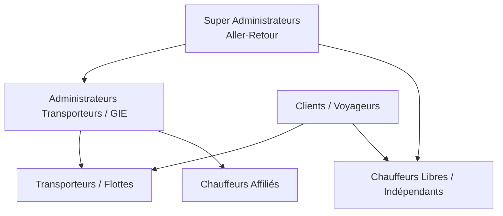
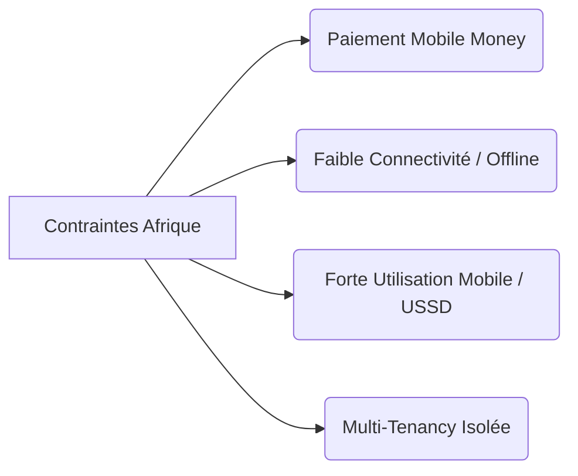
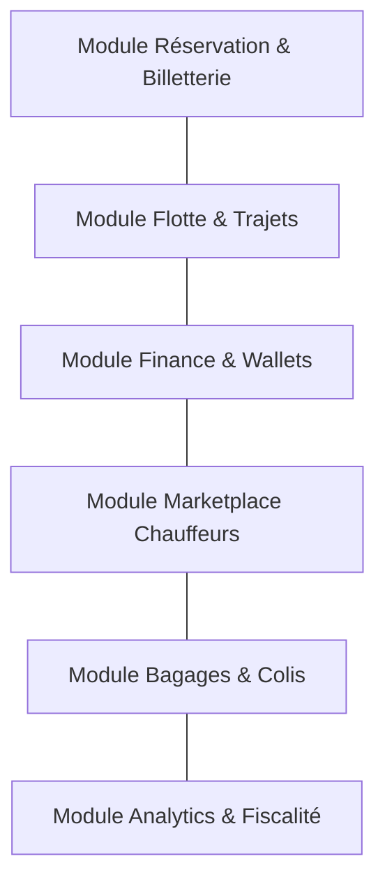

# VISION PRODUIT & ARCHITECTURE MÉTIER — ALLER-RETOUR
**Plateforme SaaS Multi-Tenant & Marketplace de Transport Inter-Urbain (Sénégal → Afrique)**

---

## 1. VISION PRODUIT
**Aller-Retour** vise à devenir la colonne vertébrale numérique de la mobilité inter-urbaine en Afrique, en commençant par le Sénégal. Le secteur du transport inter-urbain (bus, minibus "horaires", taxis sept places, flottes de GIE et compagnies privées) souffre d'une fragmentation extrême, de flux financiers informels, d'une opacité de gestion et d'une expérience voyageur asynchrone.

Notre vision consiste à fournir un écosystème SaaS unifié, modulaire et hautement résilient, capable de transformer chaque compagnie de transport en un opérateur moderne et transparent, tout en créant un pont (Marketplace) pour les chauffeurs indépendants.

---

## 2. LES ACTEURS (PERSONAS CIBLES)

### 2.1. Clients / Voyageurs
* **Profil :** Voyageurs réguliers ou occasionnels inter-villes, expéditeurs de colis.
* **Besoins :** Réserver une place garantie à l'avance, payer par Mobile Money (Wave, Orange Money, etc.), connaître l'heure exacte de départ/arrivée, suivre ses bagages, voyager en sécurité.

### 2.2. Chauffeurs Affiliés
* **Profil :** Employés ou contractuels travaillant pour un transporteur ou un GIE spécifique.
* **Besoins :** Recevoir la feuille de route digitale (manifeste), scanner les billets QR à l'embarquement, déclarer les incidents sur la route, suivre leurs gains et indemnités.

### 2.3. Chauffeurs Libres (Indépendants)
* **Profil :** Propriétaires ou locataires de véhicules homologués ne faisant pas partie d'une flotte permanente.
* **Besoins :** Rejoindre la Marketplace, publier un trajet ponctuel ou récurrent, recevoir des réservations certifiées, percevoir leurs gains sur un wallet électronique avec retrait instantané.

### 2.4. Transporteurs / Compagnies / GIE
* **Profil :** Gestionnaires de flottes (de 5 à 500+ véhicules), chefs de gares routières.
* **Besoins :** Gérer l'affectation chauffeurs/véhicules, piloter la trésorerie en temps réel, éliminer la fraude aux guichets, optimiser le taux de remplissage, disposer de rapports comptables et fiscaux précis.

### 2.5. Administrateurs Plateforme (Tenant Admins)
* **Profil :** Responsables d'exploitation au sein d'une compagnie de transport cliente du SaaS.
* **Besoins :** Configurer les lignes, tarifs, grilles horaires, et gérer les autorisations d'accès du personnel (guichetiers, contrôleurs).

### 2.6. Super Administrateurs (Équipe Aller-Retour)
* **Profil :** Opérateurs globaux du SaaS.
* **Besoins :** Gérer les abonnements des transporteurs (SaaS B2B), surveiller la santé globale de l'infrastructure, ajuster les taux de commission, auditer les flux financiers et valider l'onboarding des nouveaux transporteurs et chauffeurs libres.

---

## 3. OBJECTIFS STRATÉGIQUES & MOTEUR FINANCIER

### 3.1. Objectifs Opérationnels
1. **Éradication de l'attente incertaine :** Remplacer le système traditionnel de départ "au remplissage complet" par une planification horaire fiable et transparente.
2. **Dématérialisation totale des titres :** Généralisation des billets électroniques sécurisés par QR Code dynamique (anticopie et lisibles hors-ligne).
3. **Sécurité & Traçabilité :** Vérification KYC des chauffeurs et suivi GPS continu pour rassurer les voyageurs et les proches.

### 3.2. Moteur Financier (Modèle Économique Hybride)
* **Revenus SaaS B2B :** Abonnements mensuels/annuels facturés aux transporteurs selon la taille de leur flotte ou leurs fonctionnalités (Standard, Premium, Enterprise).
* **Commissions Marketplace B2C :** Pourcentage prélevé sur chaque transaction issue des chauffeurs libres (ex: 5% à 10% sur le prix du trajet).
* **Frais de Service Voyageur :** Micro-frais de commodité sur l'achat de billets en ligne (ex: 100 FCFA à 200 FCFA par billet).
* **Monétisation du Fret & Bagages :** Commissionnement sur l'enregistrement et la garantie des colis inter-urbains.

---

## 4. CONTRAINTES MÉTIER & TECHNOLOGIQUES

### 4.1. Isolement Multi-Tenant
* Chaque transporteur doit pouvoir opérer dans un environnement isolé (données, clients, chauffeurs, rapports) pour garantir la confidentialité et la conformité, avec possibilité de personnalisation (marque blanche).

### 4.2. Faible Connectivité & Offline-First
* Les routes inter-urbaines sénégalaises et africaines traversent des zones blanches ou à faible couverture (2G/3G instable).
* **Solution :** Stockage local (SQLite/AsyncStorage sur mobile) pour la validation des billets et la mise en file d'attente des données de trajet (synchronisation automatique au retour de la connexion).

### 4.3. Écosystème Mobile Money & Wallets
* Le taux de bancarisation classique est faible ; le Mobile Money (Wave, Orange Money, Free Money, MoMo, MTN) est le standard incontournable.
* **Solution :** Architecture de wallets virtuels intégrés pour permettre les dépôts, séquestres de paiement (escrow pour les trajets) et retraits instantanés par API Mobile Money.

### 4.4. Scalabilité et Optimisation des Coûts (Cloud & Vercel)
* L'infrastructure doit absorber des pics d'activité majeurs (ex: veilles de fêtes religieuses comme le Magal de Touba ou le Gamou, fêtes de fin d'année) tout en maintenant des coûts fixes très bas le reste du temps.
* **Solution :** Architecture Serverless sur Vercel couplée à une base de données cloud moderne (PostgreSQL) avec pooling de connexions.

---

## 5. MODULES PRINCIPAUX DE LA PLATEFORME

### 5.1. Module Réservation & Billetterie
* Moteur de recherche de trajets (origine, destination, date).
* Sélection des sièges dans le véhicule.
* Génération de QR Codes dynamiques et cryptés.
* Gestion des annulations et remboursements automatisés.

### 5.2. Module Flotte, Trajets & GPS
* Enregistrement des véhicules (carte grise, assurance, visite technique).
* Affectation des chauffeurs sur les lignes horaires.
* Tracking GPS temps réel (position, vitesse, retards calculés).
* Notification automatique de départ imminente et d'arrivée.

### 5.3. Module Finance & Wallets
* Portefeuilles virtuels (Wallets) pour chaque utilisateur, chauffeur et transporteur.
* Agrégation des moyens de paiement ouest-africains (Wave, Orange Money, carte bancaire).
* Versement automatisé des gains aux chauffeurs et reversement aux transporteurs.

### 5.4. Module Marketplace Chauffeurs Libres
* Portail de candidature et vérification d'identité (KYC, permis de conduire biométrique).
* Publication d'itinéraires indépendants.
* Système d'avis et de notation de confiance (rating 1 à 5 étoiles).

### 5.5. Module Colis & Bagages
* Enregistrement des excédents de bagages et fret léger.
* Tarification automatisée au volume ou au poids.
* Génération d'étiquettes de suivi (code-barres/QR) pour sécuriser l'envoi de colis d'une ville à l'autre.

### 5.6. Module Analytics, Rapports & Taxes d'État
* Tableaux de bord de performance par ligne, par véhicule et par chauffeur.
* Export comptable automatisé.
* Calcul en temps réel et prélèvement à la source des taxes locales ou redevances d'État (frais de gare routière, taxes de transport inter-urbain).
